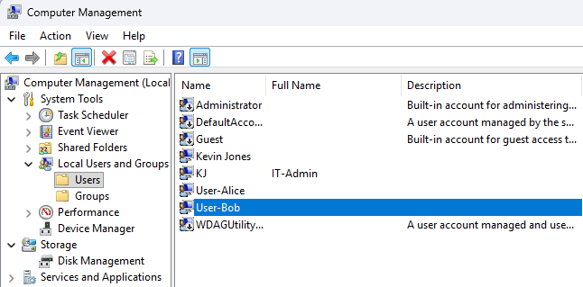

## Day 2 – Password Reset & Account Recovery

This lab focuses on resolving one of the most common IT support issues: user login failures.

### Tasks Completed
- Simulated a user login failure
- Reset a local user password using Computer Management
- Verified successful user login
- Documented the resolution

### Tools Used
- Windows 11
- Computer Management
- Local Users and Groups

### Skills Demonstrated
- Account recovery
- Administrative troubleshooting
- User support workflows
- Professional documentation

---

## Evidence

*Local user password reset performed using Computer Management.*

