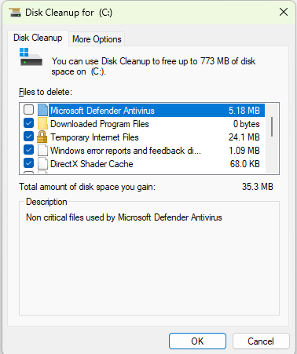

## Day 4 – Disk Cleanup & Storage Troubleshooting

This lab focuses on resolving low disk space and performance issues by safely removing unnecessary files using built-in Windows tools.

---

## Tasks Completed
- Reviewed disk usage on the system drive
- Identified files safe for removal
- Performed Disk Cleanup on Local Disk (C:)
- Verified successful cleanup without system impact

---

## Tools Used
- Windows 11
- Disk Cleanup

---

## Skills Demonstrated
- Storage troubleshooting
- Preventative maintenance
- Risk-aware system cleanup
- End-user support workflows

---

## Evidence

*Disk Cleanup performed to safely remove temporary and non-essential files.*
