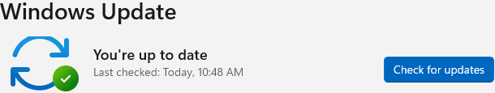

## Day 5 – Windows Update Troubleshooting

This lab focuses on verifying system patch status and ensuring Windows updates are properly applied to maintain system security and stability.

---

## Tasks Completed
- Accessed Windows Update settings
- Reviewed current update status
- Verified system was fully up to date
- Confirmed no pending or failed updates

---

## Tools Used
- Windows 11
- Windows Update

---

## Skills Demonstrated
- Patch management verification
- System maintenance
- Security update awareness
- End-user support workflows

---

## Evidence

*Windows Update status reviewed and confirmed system is fully up to date.*
