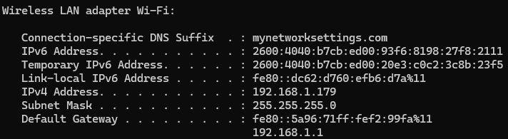
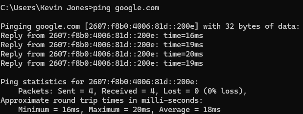

## Day 7 – Network Troubleshooting (Basic Connectivity)

This lab focuses on diagnosing basic network connectivity issues commonly reported by end users, such as no internet access or intermittent connectivity.

---

### Tasks Completed
- Verified IP configuration using `ipconfig`
- Identified the active network adapter
- Confirmed a valid DHCP-assigned IPv4 address
- Tested internet connectivity using `ping`
- Verified DNS resolution

---

### Tools Used
- Windows 11
- Command Prompt
- ipconfig
- ping

---

### Skills Demonstrated
- Network troubleshooting
- IP address analysis
- Basic DNS validation
- End-user connectivity support

---

### Evidence

*Verified valid IPv4 address, subnet mask, and default gateway.*

*Confirmed internet connectivity and DNS resolution using ping.*
