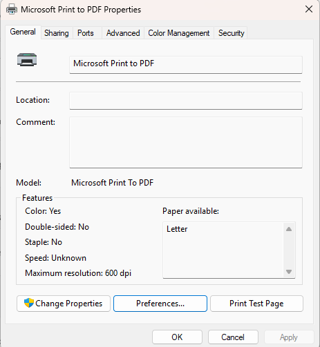
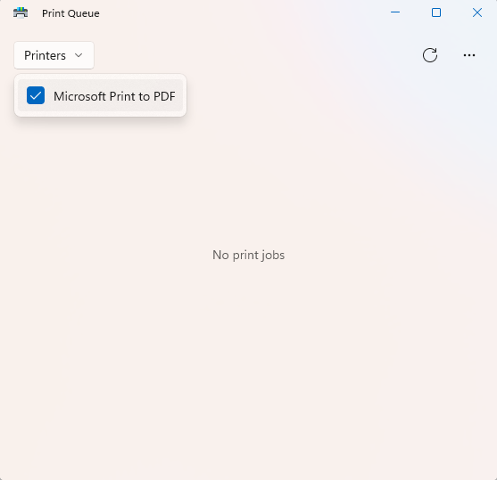

## Day 8 – Device & Printer Troubleshooting

This lab focuses on diagnosing and verifying printer functionality, a common IT support task when users report printing issues.

---

### Tasks Completed
- Reviewed installed printers and devices
- Opened printer properties to verify configuration
- Checked printer status and availability
- Inspected the print queue for stuck or pending jobs
- Confirmed normal printer operation

---

### Tools Used
- Windows 11
- Devices & Printers
- Printer Properties
- Print Queue

---

### Skills Demonstrated
- Device troubleshooting
- Printer management
- Peripheral support
- End-user issue validation

---

### Evidence

*Verified printer configuration and availability.*

*Confirmed no pending print jobs and normal queue status.*
