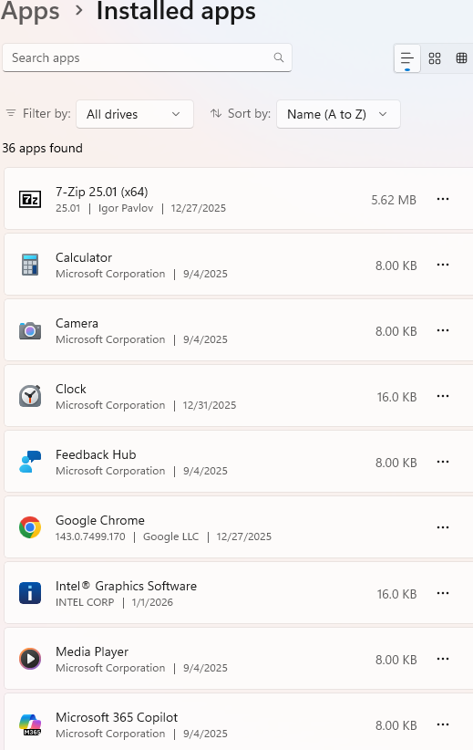
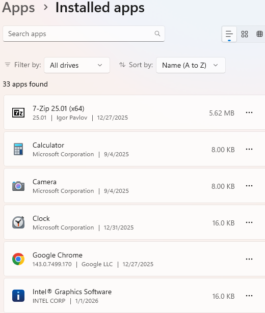

## Day 9 – Software Installation & Removal

This lab focuses on managing installed applications, a common IT support task when users request software installation or removal.

---

### Tasks Completed
- Reviewed installed applications using Windows settings
- Identified non-essential software
- Safely uninstalled a user application
- Verified successful software removal

---

### Tools Used
- Windows 11
- Apps & Features (Installed Apps)

---

### Skills Demonstrated
- Software inventory management
- Safe application removal
- User request handling
- Verification of remediation

---

### Evidence

*Reviewed installed applications prior to removal.*

*Confirmed successful application removal.*
