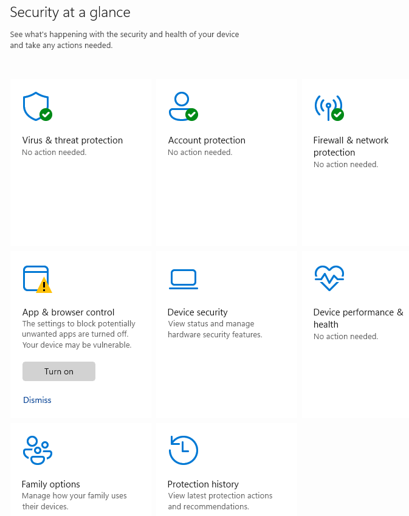
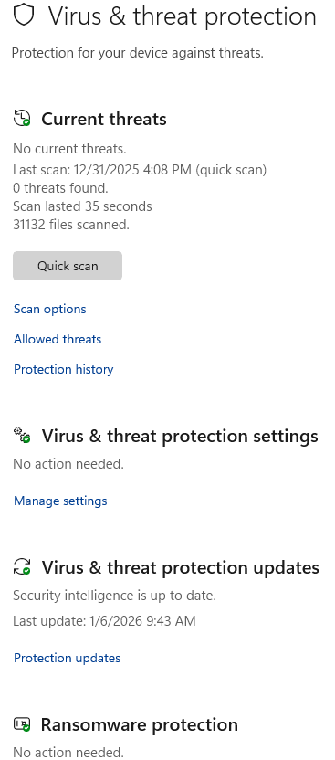
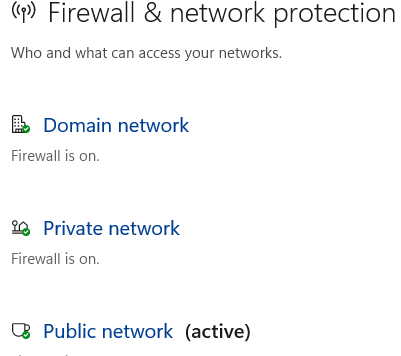

## Day 10 – Basic Security Checks (Windows Defender & Firewall)

This lab focuses on verifying baseline endpoint security settings, a common IT support task when users ask whether their system is protected.

---

### Tasks Completed
- Reviewed Windows Security dashboard
- Verified antivirus status using Windows Defender
- Confirmed recent threat scan results
- Verified firewall status for active network profiles

---

### Tools Used
- Windows 11
- Windows Security
- Microsoft Defender Antivirus
- Windows Firewall

---

### Skills Demonstrated
- Endpoint security awareness
- Antivirus verification
- Firewall validation
- Security posture assessment
- User security reassurance

---

### Evidence

*Reviewed overall system security status.*

*Confirmed active antivirus protection and up-to-date definitions.*

*Verified firewall enabled for active network profiles.*
