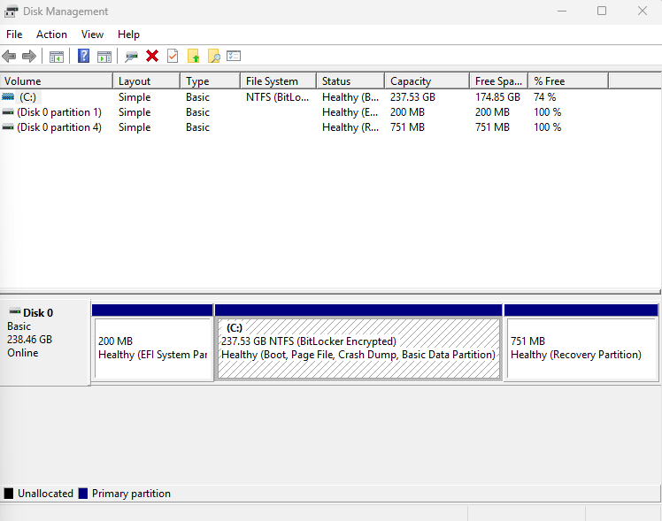
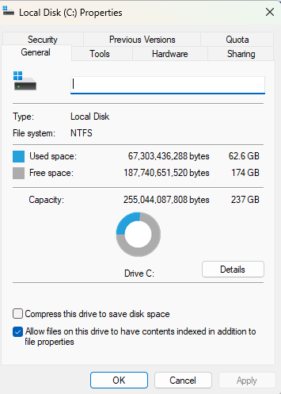
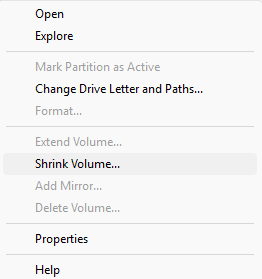

## Day 14 – Disk Management & Storage Troubleshooting

This lab focuses on reviewing disk configuration and storage allocation using Windows Disk Management, a common IT support task when diagnosing storage-related issues.

---

### Tasks Completed
- Opened and reviewed Disk Management
- Identified disks, partitions, and volumes
- Reviewed volume properties including file system and capacity
- Observed partition layout without making changes
- Reviewed shrink volume option to understand storage modification workflow

---

### Tools Used
- Windows 11
- Disk Management

---

### Skills Demonstrated
- Disk and volume identification
- Storage troubleshooting
- Partition awareness
- Risk-aware system administration
- IT support diagnostic workflows

---

### Evidence

*Reviewed disk layout and volume configuration.*

*Verified file system type and storage usage.*

*Reviewed volume modification option without applying changes.*
