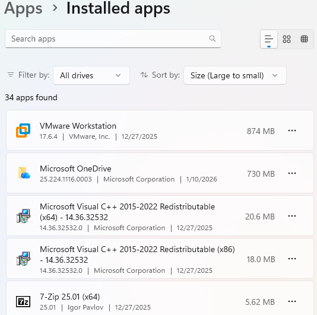

# Day 16 – Storage Usage & Cleanup Optimization

This lab focuses on analyzing disk usage, identifying storage-heavy areas,
and safely reclaiming disk space using built-in Windows tools.

## Tasks Completed
- Reviewed overall storage usage breakdown
- Identified space consumed by system files, apps, and temporary files
- Analyzed temporary files safe for removal
- Identified installed applications by storage size
- Demonstrated disk cleanup best practices

## Tools Used
- Windows 11 Settings
- Storage Usage
- Temporary Files Cleanup
- Installed Apps

## Skills Demonstrated
- Storage analysis
- Disk cleanup and optimization
- System maintenance
- End-user support workflows

## Evidence

  
*Overall disk usage breakdown.*

  
*Review of removable temporary files.*

  
*Safe cleanup selections identified.*

  
*Largest applications identified for optimization review.*
