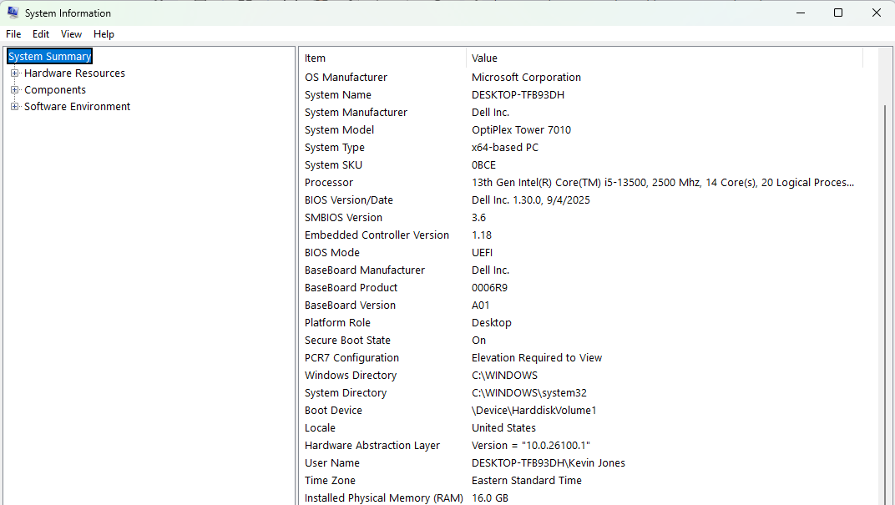
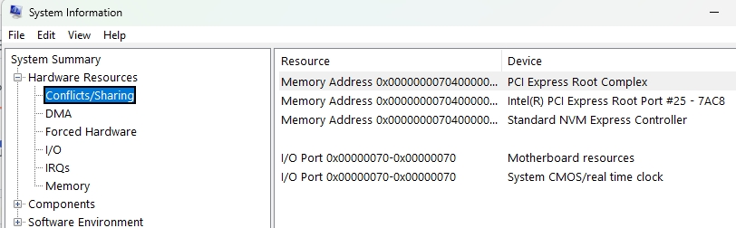
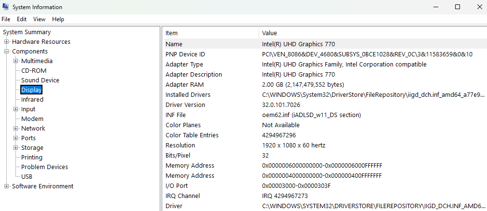

# Day 18 – System Information & Hardware Inventory

This lab focuses on collecting detailed system and hardware information using built-in Windows tools. The goal is to document system specifications commonly required for IT support, troubleshooting, and escalation.

## Tasks Completed
- Accessed System Information using msinfo32
- Reviewed system summary details including OS, processor, and memory
- Checked hardware resource conflicts
- Identified display adapter information
- Reviewed installed storage disk details

## Tools Used
- Windows 11
- System Information (msinfo32)

## Skills Demonstrated
- Hardware inventory documentation
- System specification analysis
- Troubleshooting preparation
- IT asset awareness
- Escalation-ready information gathering

## Evidence

  
*Reviewed operating system and hardware specifications.*

  
*Verified hardware resources and conflict status.*

  
*Reviewed graphics hardware configuration.*

  
*Identified installed storage devices and capacity.*
