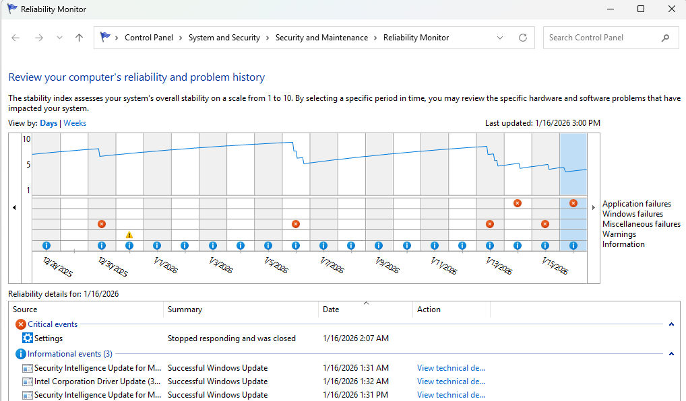
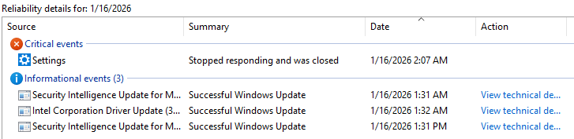
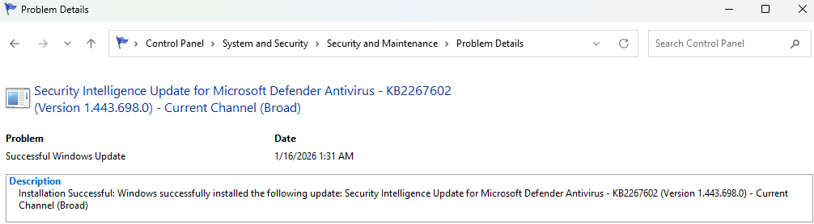

# Day 19 – Reliability Monitor & System Stability Analysis

This lab focuses on using Windows Reliability Monitor to review system stability, identify recurring issues, and analyze application and system failures over time.

## Tasks Completed
- Accessed Windows Reliability Monitor
- Reviewed system stability index over multiple days
- Identified application and system warning events
- Analyzed failure details and error summaries
- Reviewed technical information associated with reliability events

## Tools Used
- Windows 11
- Reliability Monitor (perfmon /rel)

## Skills Demonstrated
- System stability analysis
- Event correlation over time
- Proactive troubleshooting
- Root-cause investigation
- IT escalation preparation

## Evidence

  
*Reviewed system stability index and timeline.*

  
*Analyzed application and system warning events.*

  
*Reviewed detailed error information for troubleshooting.*
