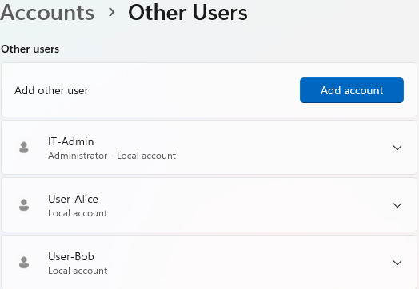
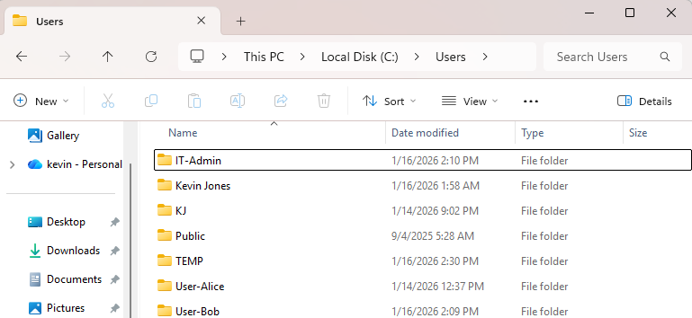
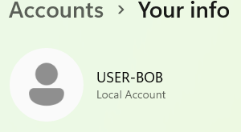
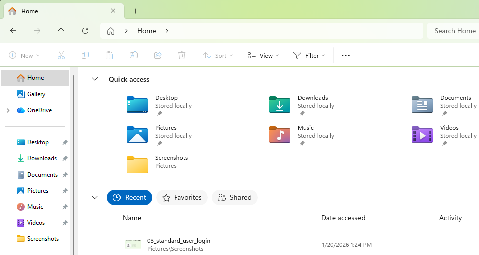

# Day 21 – Local User Profile Troubleshooting

This lab focuses on verifying and troubleshooting local user profiles in Windows. The goal was to confirm proper profile creation, folder structure, and successful user login behavior, which are common IT support responsibilities.

## Tasks Completed
- Reviewed configured local user accounts
- Verified standard and administrator account types
- Inspected user profile folders under C:\Users
- Logged in as a standard user to validate profile loading
- Confirmed normal profile behavior and folder accessibility

## Tools Used
- Windows 11 Settings
- File Explorer
- Local User Accounts

## Skills Demonstrated
- User account verification
- User profile validation
- Windows file system navigation
- Troubleshooting methodology
- End-user support workflows

## Evidence

  
*Verified configured local user accounts.*

  
*Reviewed profile directories under C:\Users.*

  
*Confirmed successful login as a standard user.*

  
*Verified healthy user profile with default folders present and accessible.*
