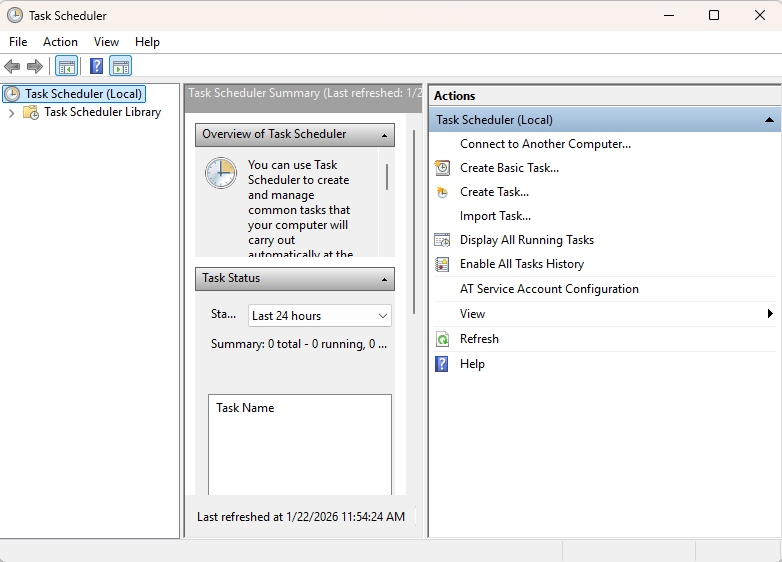
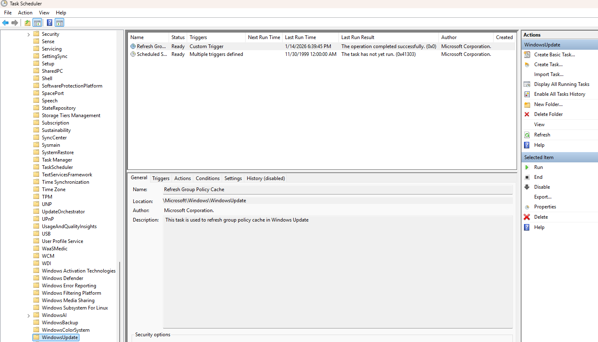
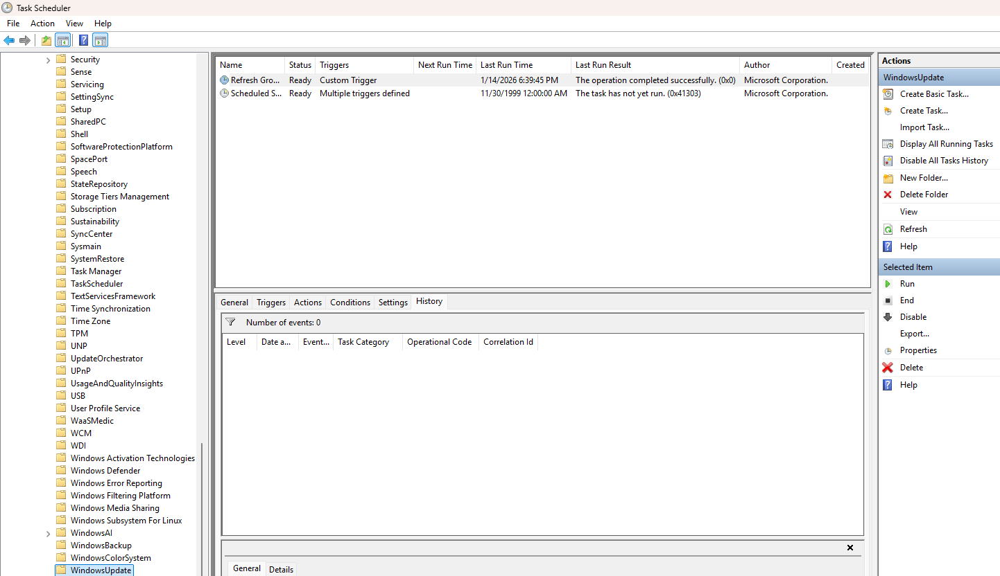

# Day 22 – Task Scheduler & Automated Maintenance

This lab focuses on reviewing and validating automated tasks using Windows Task Scheduler. The goal is to understand how scheduled tasks support system maintenance and how IT support verifies task execution and history.

## Tasks Completed
- Opened Windows Task Scheduler
- Reviewed the Task Scheduler Library and built-in tasks
- Inspected a Windows maintenance task configuration
- Reviewed task triggers, actions, and last run status
- Enabled and reviewed task history for execution validation

## Tools Used
- Windows 11
- Task Scheduler (taskschd.msc)

## Skills Demonstrated
- Task Scheduler navigation
- Automation awareness
- Preventive maintenance validation
- Task execution troubleshooting
- IT support diagnostic workflows

## Evidence

  
*Reviewed Task Scheduler Library and available tasks.*

  
*Inspected task configuration, triggers, and actions.*

  
*Reviewed task execution history to validate automation.*
