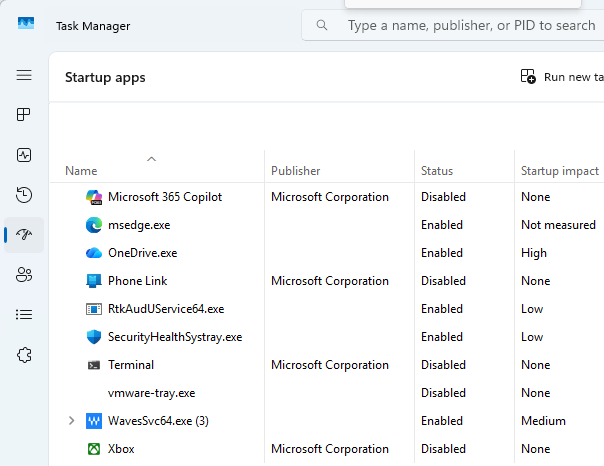
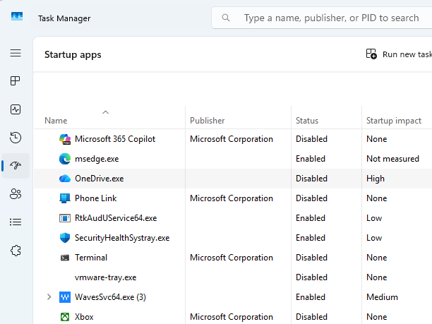
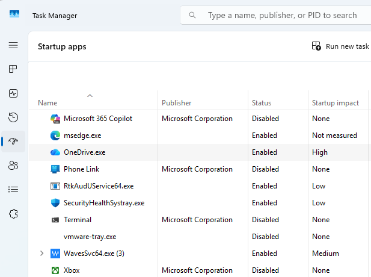
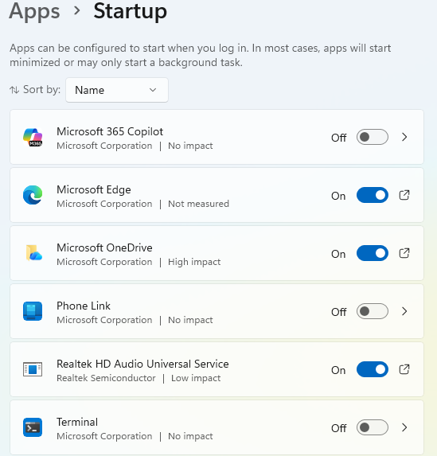

# Day 23 – System Startup & Boot Troubleshooting

This lab focuses on reviewing and managing startup applications to troubleshoot slow boot times and unnecessary background processes. The goal is to identify startup impact and safely enable or disable applications during system startup.

## Tasks Completed
- Opened Task Manager and reviewed startup applications
- Identified startup impact levels for installed applications
- Disabled a non-critical startup application
- Re-enabled the application to restore original behavior
- Reviewed startup application settings through Windows Settings

## Tools Used
- Windows 11
- Task Manager
- Windows Settings (Startup Apps)

## Skills Demonstrated
- Startup performance analysis
- Safe application management
- Boot troubleshooting techniques
- System optimization awareness
- End-user support workflows

## Evidence

  
*Reviewed startup applications and their impact on system boot.*

  
*Disabled a non-critical startup application.*

  
*Re-enabled the startup application to restore original settings.*

  
*Reviewed startup applications using Windows Settings.*
