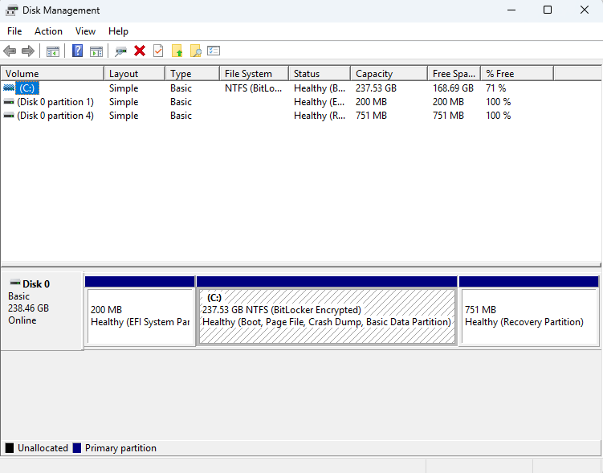
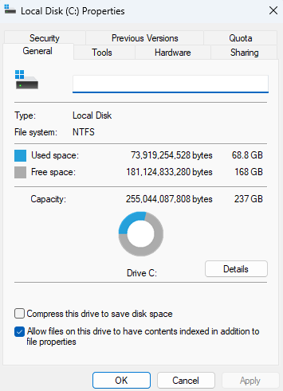
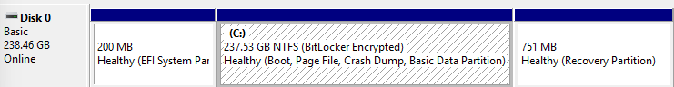

# Day 27 – Disk Management & Volume Configuration

This lab focuses on reviewing disk and volume configuration using Windows Disk Management. The goal is to understand how storage devices, partitions, and file systems are organized and how IT support verifies disk health without making destructive changes.

## Tasks Completed
- Opened Windows Disk Management
- Reviewed disk and volume status
- Identified system partitions and primary volume
- Verified disk layout using graphical view
- Inspected volume properties including file system and free space

## Tools Used
- Windows 11
- Disk Management (diskmgmt.msc)

## Skills Demonstrated
- Disk and volume inspection
- Storage troubleshooting awareness
- File system identification
- Safe system administration practices
- IT support diagnostic workflows

## Evidence

  
*Reviewed disk status and available volumes.*

  
*Verified file system type and storage usage.*

  
*Reviewed partition layout using graphical view.*
