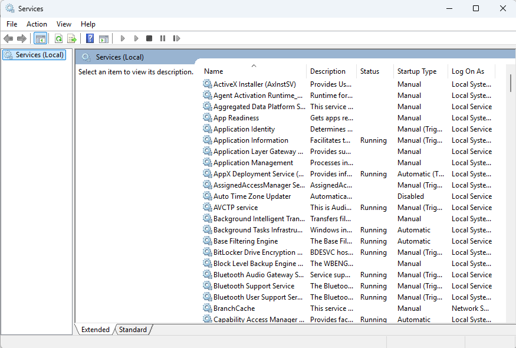
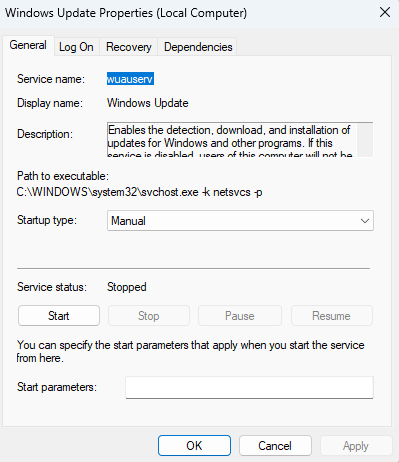
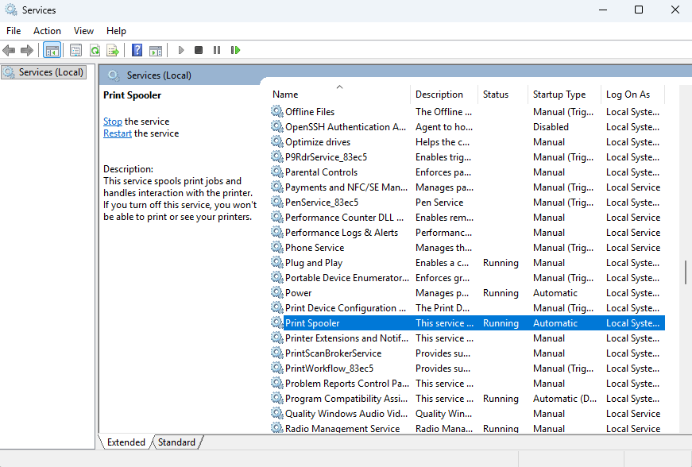

# Day 28 – Windows Services & Troubleshooting

This lab focuses on inspecting and troubleshooting Windows services using built-in administrative tools. The goal is to understand how background services operate, how to safely verify their status, and how IT support addresses common service-related issues.

## Tasks Completed
- Opened Windows Services console (services.msc)
- Reviewed running and stopped services
- Inspected service status and startup types
- Verified Windows Update service configuration
- Restarted the Print Spooler service
- Confirmed Print Spooler service status after restart

## Tools Used
- Windows 11
- Services Console (services.msc)

## Skills Demonstrated
- Windows service management
- Background process troubleshooting
- Safe service restart procedures
- Understanding of startup types
- IT support diagnostic workflows

## Evidence

  
*Reviewed list of Windows services and their status.*

  
*Verified configuration and startup type of Windows Update service.*

  
*Restarted Print Spooler service and confirmed running status.*

## Outcome
Windows services were successfully reviewed and verified. Print Spooler service was restarted without issue, demonstrating safe service troubleshooting practices.
