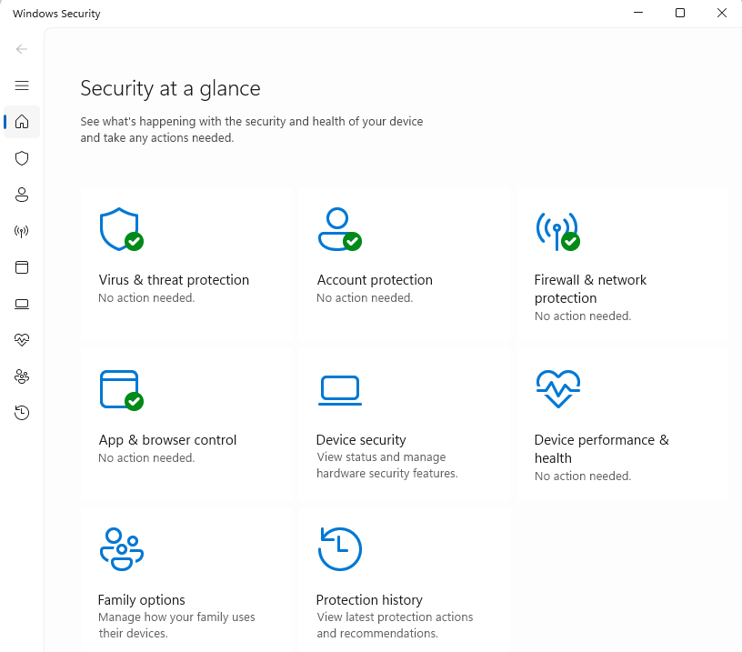
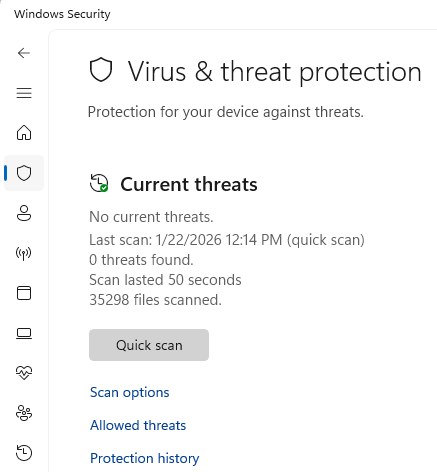
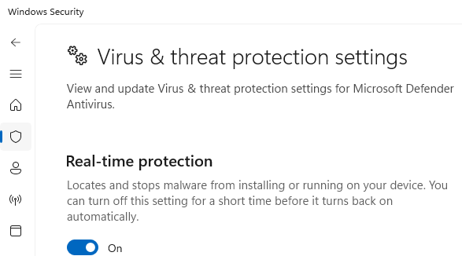
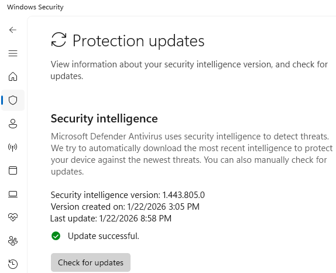

# Day 29 – Windows Defender & Malware Protection

This lab focuses on verifying endpoint security using Microsoft Defender Antivirus. The objective is to confirm that malware protection is enabled, up to date, and functioning as expected to protect the system from threats.

## Tasks Completed
- Opened Windows Security dashboard
- Verified overall security status
- Reviewed Virus & threat protection status
- Confirmed real-time protection is enabled
- Checked Microsoft Defender definition update status

## Tools Used
- Windows 11
- Windows Security
- Microsoft Defender Antivirus

## Skills Demonstrated
- Endpoint security verification
- Malware protection awareness
- Antivirus configuration review
- Security hygiene best practices
- IT and cybersecurity crossover knowledge

## Evidence

  
*Verified overall system security status.*

  
*Reviewed current threat status and protection details.*

  
*Confirmed real-time antivirus protection is active.*

  
*Verified malware definitions are up to date.*

## Outcome
Microsoft Defender Antivirus is active, up to date, and providing real-time protection. No threats were detected, and no remediation was required.
